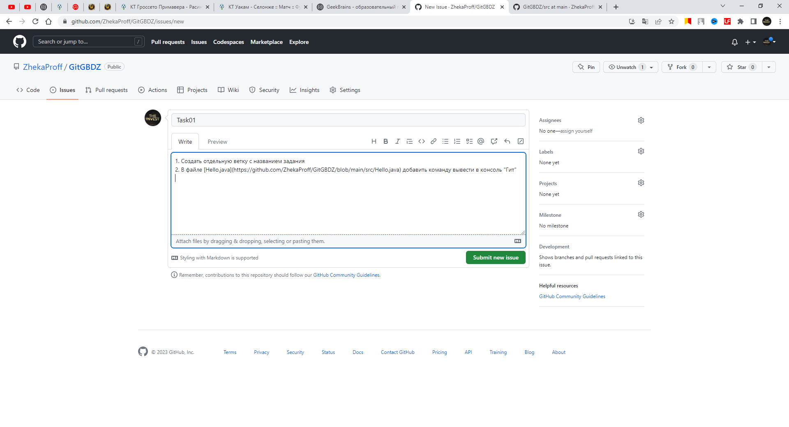
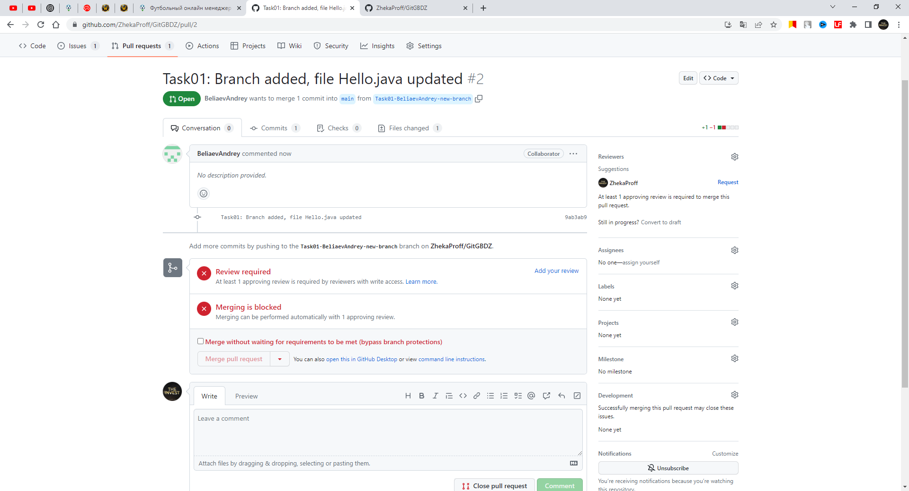
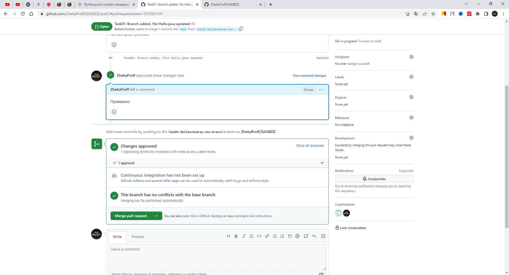

# GitGBDZ
* DZ1
1. Выберите какой-нибудь проект на изучаемом вами языке программирования, с которым вы будете тренироваться работать в Git, и инициализируйте в папке этого проекта локальный репозиторий.
   
2. Создайте непустой удалённый репозиторий (например, с файлом README.md) с именем, соответствующим имени этого проекта.
   
3. Подключите свой проект к этому удалённому репозиторию и отправьте в него код этого проекта. Самостоятельно разрешите конфликты и проблемы, если они возникнут при выполнении данного задания
   
    команды:
   - git fetch
   - git merge origin/main --allow-unrelated-histories
   - git push --set-upstream origin main

* DZ2 Работа с изменениями

1. Просмотрите историю коммитов в своём проекте и выберите три случайных коммита. Просмотрите изменения, которые были в них сделаны.

команда: git log --oneline.

   

команда: git diff <хэш коммита> позволяет посмотреть какие изменения были сделаны
2. Верните эти изменения командой git revert последовательно, чтобы в итоге получилось тоже три коммита.
   
3. Попробуйте отменить эти три коммита:
* последний — командами git reset --soft и git restore;
  Данная команда нас вернула на шаг назад, пришлось удалять изменения командой git restore .src/Hello.java
  
* предпоследний — командой git reset --mixed и git restore;

  Результат был такой же как и git reset –soft, , пришлось удалять изменения командой git restore
* первый — командой git reset --hard.
  
  Вернуло нас на изначальное состояния до revert. Использовать git restore не нужно было.
  
* 

* DZ3 Практики и инструменты для работы с Git
1. Пригласите в свой проект кого-то из коллег по обучению, дайте им доступ к своему репозиторию (кроме ветки master).

Ограничил доступ в настройках репозитария к главной ветке и пригласил сотрудника в рпозитарий. 
2. Поставьте ему в GitHub задачу по своему проекту, попросите её выполнить в отдельной ветке, а после выполнения — создать pull request и перевести задачу обратно на вас

3. Проверьте выполнение задачи, примите pull request и удалите ветку, в которой решалась данная задача

